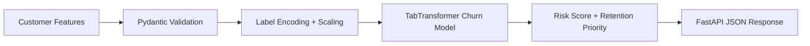

# ACIE - Autonomous Customer Intelligence Engine

ACIE is a churn prediction system for subscription businesses. This repository currently focuses on the **churn prediction and inference API layer**: a trained TabTransformer model, saved preprocessing artifacts, and a FastAPI service for production-style risk scoring.

## Problem

Subscription businesses lose revenue when high-risk customers churn without intervention. ACIE predicts customer churn probability so revenue teams can prioritize retention actions earlier.

## What This Repo Currently Includes

- Churn prediction API built with FastAPI
- Production-style model loading and preprocessing service
- Customer risk scoring with retention priority labels
- Training pipeline for the saved TabTransformer model
- Saved model artifacts for local inference
- API tests and Docker support

## What This Repo Does Not Yet Implement

The earlier repo description referenced LTV estimation, customer segmentation, reinforcement learning, and Monte Carlo simulation. Those are **not implemented in the visible codebase yet**, so this README does not overclaim them.

## Architecture



## Project Structure

```text
acie-system/
├── api/
│   ├── __init__.py
│   ├── main.py
│   ├── schemas.py
│   └── services/
│       ├── __init__.py
│       └── model_service.py
├── data/
│   ├── processed/
│   ├── raw/
│   └── sample_input.json
├── models/
│   ├── churn_model_production.py
│   └── saved/
├── tests/
│   └── test_api.py
├── Dockerfile
├── README.md
├── predict.py
└── requirements.txt
```

## Model Contract

The saved production model expects these 14 features:

- `age`
- `country`
- `acquisition_channel`
- `cac`
- `initial_plan`
- `tenure_months`
- `avg_logins_3m`
- `avg_sessions_3m`
- `avg_session_duration_3m`
- `avg_features_used_3m`
- `engagement_score_latest`
- `payment_failures`
- `payment_success_rate`
- `total_support_tickets`

For API usability, the request schema also accepts:

- `engagement_score` as an alias for `engagement_score_latest`
- `support_tickets` as an alias for `total_support_tickets`

## API Usage

### `POST /predict`

```json
{
  "age": 35,
  "country": "UK",
  "acquisition_channel": "Organic",
  "cac": 45.5,
  "initial_plan": "Basic",
  "tenure_months": 12,
  "avg_logins_3m": 25,
  "avg_sessions_3m": 30,
  "avg_session_duration_3m": 24.5,
  "avg_features_used_3m": 6,
  "engagement_score": 0.72,
  "payment_failures": 1,
  "payment_success_rate": 0.96,
  "support_tickets": 2
}
```

### Example response

```json
{
  "churn_probability": 0.2148,
  "risk_level": "LOW",
  "retention_priority": "Monitor",
  "model_loaded": true,
  "used_features": 14
}
```

## Metrics

These metrics come from the saved churn model artifact:

- AUC-ROC: `0.8155`
- F1 Score: `0.8378`
- Accuracy: `0.7687`

## Run Locally

```bash
pip install -r requirements.txt
uvicorn api.main:app --reload
```

## Local Smoke Test

```bash
python predict.py --input data/sample_input.json
pytest
```

## Docker

```bash
docker build -t acie-system .
docker run -p 8000:8000 acie-system
```

## Endpoints

- `GET /`
- `GET /health`
- `GET /features`
- `GET /metrics`
- `POST /predict`

## Notes for Reviewers

- The repo is centered on **churn prediction**, not a full customer intelligence platform yet.
- Saved model artifacts are included so the API works immediately without retraining.
- The training script is import-safe now, so the model class can be reused cleanly in the API.
